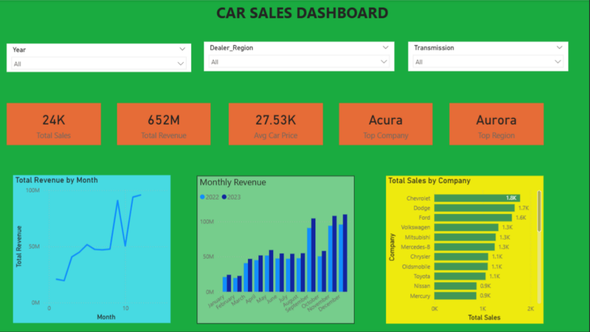
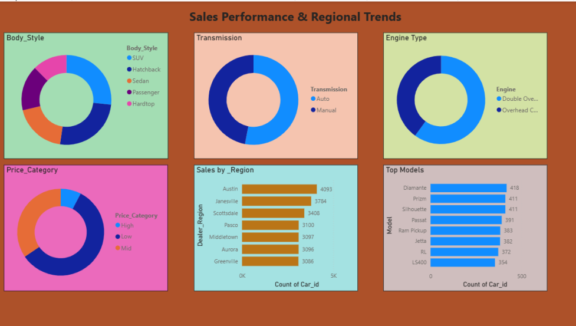
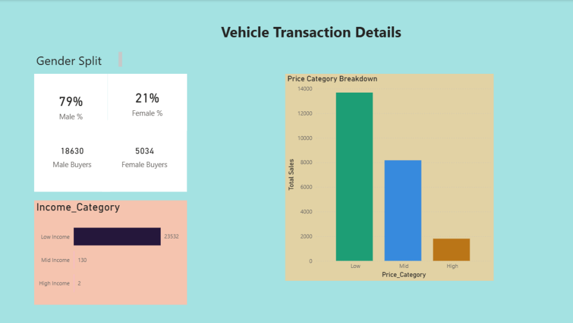
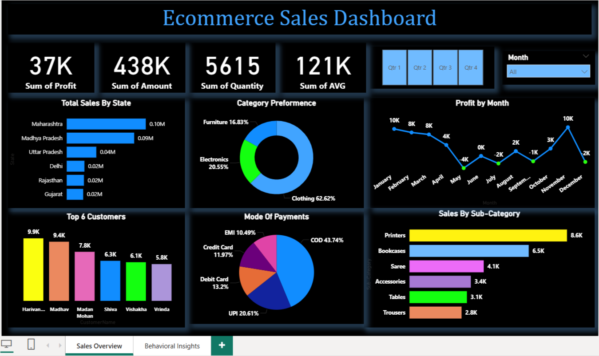
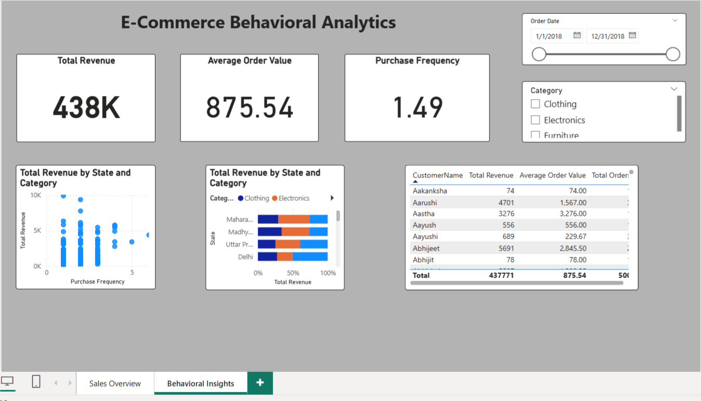

# 🚗 Car Sales & Business Intelligence Analysis

An end-to-end data analytics and business intelligence project utilizing **Python** and **Power BI** to optimize regional dealership performance, track sales volume, and analyze purchasing trends.


---

## 📋 Project Overview & Problem Statement

Automotive dealership executives need clear, real-time insights to understand regional consumer demand, optimize vehicle distribution, and maximize top-line revenue. This project analyzes **23,664 vehicle transactions (2022–2023)** to uncover critical factors driving sales across car body styles, regional markets, transmission types, and customer segments.

---

## 📸 Dashboard Preview





---

## 🛠️ Tech Stack & Architecture

| Tool | Purpose |
|------|---------|
| Python, Pandas, NumPy | Data exploration & preprocessing |
| Microsoft Power BI Desktop | Data modeling & visualizations |
| DAX (Data Analysis Expressions) | Advanced metrics & KPIs |

---

## 📁 Repository Structure

```
car-sales-dashboard-project/
├── images/                          # Dashboard screenshots
│   ├── sales overview.png
│   ├── attrition.png
│   └── Demographics and Brand Performance.png
├── Car_Sales_Cleaned.csv            # Cleaned dataset (23,664 rows)
├── EDA_analysis.ipynb               # Jupyter Notebook for EDA & validation
├── car_sales_dashboard.pbix         # Master Power BI report file
└── README.md                        # Project documentation

```

📊 Dataset Overview

- **Rows:** 23,664 transactions
- **Columns:** 20 features
- **Date Range:** January 2022 – December 2023
- **Price Range:** $1,200 – $75,400
- **Brands Covered:** 30 manufacturers (Ford, Toyota, BMW, Dodge, Cadillac, and more)
- **Regions:** 7 dealership regions (Austin, Janesville, Scottsdale, Aurora, Greenville, Pasco, Middletown)

### Dataset Preview

| Car_id | Date | Customer_Name | Gender | Annual_Income | Company | Model | Price |
|:---|:---|:---|:---|:---|:---|:---|:---|
| C_CND_000001 | 2022-01-02 | Geraldine | Male | $13,500 | Ford | Expedition | $26,000 |
| C_CND_000002 | 2022-01-02 | Gia | Male | $1,480,000 | Dodge | Durango | $19,000 |
| C_CND_000003 | 2022-01-02 | Gianna | Male | $1,035,000 | Cadillac | Eldorado | $31,500 |

---

## 📖 Data Dictionary

| Column Name | Data Type | Description |
|:---|:---|:---|
| **Car_id** | String | Unique identifier for each car sale transaction |
| **Date** | Date | Date when the vehicle transaction occurred |
| **Customer_Name** | String | Name of the vehicle buyer |
| **Gender** | String | Gender of the buyer |
| **Annual_Income** | Integer | Customer's yearly income in USD |
| **Dealer_Name** | String | Name of the dealership franchise |
| **Company** | String | Car manufacturer / brand (e.g., Ford, Toyota) |
| **Model** | String | Specific model name of the vehicle |
| **Engine** | String | Engine architecture type (e.g., Overhead Camshaft) |
| **Transmission** | String | Transmission type — Auto or Manual |
| **Color** | String | Exterior color of the sold vehicle |
| **Price** | Integer | Final sale price in USD |
| **Body_Style** | String | Vehicle classification — SUV, Sedan, Hatchback, Hardtop, Passenger |
| **Dealer_Region** | String | Geographic market location of the dealership |
| **Price_Category** | String | Price tier — Low, Mid, or High |
| **Affordability_Ratio** | Decimal | Price-to-income ratio for the buyer |
| **Year** | Integer | Year of the transaction |
| **Month** | Integer | Month number (1-12) |
| **Month_Name** | String | Full month name |
| **Income_Category** | String | Customer income bracket — Low, Mid, or High Income |

---
## 📊 Key Performance Indicators (KPIs)

- Total Sales Revenue: 651,550,154
- Total Cars Sold: 23,664
- Average Selling Price: 27,533.39
- Top Selling Brand: Ford
- Top Dealer Region: Austin
- Unique Customers: 3,014

## 💡 Business Insights

- Ford generated the highest sales revenue among all brands.
- Austin was the top-performing dealer region by revenue.
- SUVs were the most frequently sold body style with 6,318 sales.
- Automatic transmission vehicles (12,553) slightly outsold manual vehicles (11,111).
- Male customers accounted for the majority of purchases (18,630 compared to 5,034 female customers).

---

# 🛒 E-Commerce Sales & Customer Behaviour Analysis

An end-to-end data analytics project uncovering profitability drivers, seasonal patterns, regional demand, and customer retention insights for an Indian e-commerce platform.


---

## 📋 Project Overview

High revenue does not guarantee high profit. This project analyses **1,500 order line items across 500 orders (2018)** to answer five critical business questions:

1. Which product sub-categories are destroying margin despite high volume?
2. Which payment channels generate the most profit per transaction?
3. Which months and quarters drive revenue — and which are loss-making?
4. Which states and cities are the strongest markets?
5. What share of customers are repeat buyers, and how much revenue risk does low retention create?

---

## 🖥️ Dashboard

| Page 1 | Page 2 |
|--------|--------|
|  |  |

---

## 🔑 Key Findings

| Finding | Detail |
|---------|--------|
| **35.3% of line items are loss-making** | Losing ₹38,079 while gaining ₹75,042 — net profit only ₹36,963 (8.4% margin) |
| **5 sub-categories are net-negative** | Electronic Games, Furnishings, Kurti, Skirt, Leggings destroy margin with every sale |
| **Credit Card earns 14.5% margin vs UPI's 4.8%** | Statistically significant (t-test p = 0.0002) — payment channel mix drives profitability |
| **Q3 is overall loss-making (−2% margin)** | July alone at −16.5% margin — the worst single month |
| **Only 31.8% of customers repeat-purchase** | One-time buyers are 68.2% — retention is the largest untapped growth lever |
| **Top customer by revenue is loss-making** | Harivansh: ₹9,902 revenue, −₹157 profit — optimising revenue alone is dangerous |

---

## 📁 Repository Structure

```
Ecommerce-Customer-Behavior-Analysis/
├── Orders.csv                              # 500 orders — date, customer, state, city
├── Details.csv                             # 1,500 line items — amount, profit, qty, category
├── ecommerce.pbix                          # Power BI interactive dashboard
├── dashboard/
│   ├── Screenshot (368).png               # Dashboard page 1
│   ├── Screenshot (370).png               # Dashboard page 2
│   └── images/                            # Charts generated by EDA notebook
├── Python_Scripts/
│   ├── EDA_analysis.ipynb                  # Full EDA: 12 sections, 10+ charts, 3 stat tests
│   └── data_preprocessing.py              # Cleaning + feature engineering pipeline
└── SQL_Analytics/
    ├── business_analytics_queries.sql      # 20 analytical SQL queries (MySQL 8+ syntax)
    ├── sql_runner.py                       # Run all queries via DuckDB (zero setup)
    └── schema_setup.sql                   # MySQL schema with FK constraints
```

---

## 📊 Dataset

### Orders.csv (500 rows)
| Column | Type | Description |
|--------|------|-------------|
| Order ID | String | Unique identifier |
| Order Date | Date | DD-MM-YYYY |
| CustomerName | String | Customer name |
| State | String | 19 Indian states |
| City | String | Delivery city |

### Details.csv (1,500 rows)
| Column | Type | Description |
|--------|------|-------------|
| Order ID | String | FK → Orders |
| Amount | Integer | Sale value (₹) |
| Profit | Integer | Profit/loss — can be negative |
| Quantity | Integer | Units sold |
| Category | String | Electronics / Clothing / Furniture |
| Sub-Category | String | 17 product types |
| PaymentMode | String | COD / UPI / Debit Card / Credit Card / EMI |

---

## 🛠️ Tech Stack

| Tool | Purpose |
|------|---------|
| Python — Pandas, Matplotlib, Seaborn | Data cleaning, EDA, 10+ visualisations |
| SciPy | Statistical hypothesis testing (t-test, ANOVA, Pearson) |
| SQL — DuckDB / MySQL 8+ | 20 analytical queries: window functions, CTEs, rolling averages |
| Power BI + DAX | Interactive 2-page business intelligence dashboard |

---

## 🚀 How to Run

### Python EDA Notebook
```bash
pip install pandas matplotlib seaborn scipy jupyter
cd Python_Scripts
jupyter notebook EDA_analysis.ipynb
```

### Data Preprocessing
```bash
cd Python_Scripts
python data_preprocessing.py
# → creates Cleaned_Merged.csv in project root
```

### SQL Analysis — zero database setup required
```bash
pip install duckdb pandas
cd SQL_Analytics

python sql_runner.py                   # run all 20 queries
python sql_runner.py --section 2       # Section 2: Profitability
python sql_runner.py --section 5       # Section 5: Payment Mode
python sql_runner.py --export          # save all results to sql_results/ as CSVs
```

### Power BI Dashboard
Open `ecommerce.pbix` in Power BI Desktop. If prompted, update data source paths to your local `Orders.csv` and `Details.csv`.

---

## 📈 SQL Coverage — 20 Queries across 7 Sections

| Section | Queries | Topics |
|---------|---------|--------|
| 1. Executive KPIs | 2 | Business summary, loss exposure |
| 2. Profitability | 3 | Sub-category margins, loss leaders, category mix |
| 3. Time Series | 4 | Monthly/quarterly trends, MoM growth, seasonality index |
| 4. Regional | 3 | State ranking, city AOV, top product per state |
| 5. Payment Mode | 2 | Channel profitability, payment preference by category |
| 6. Customer | 3 | Customer value ranking, repeat vs one-time, loss-making customers |
| 7. Advanced | 3 | 3-month rolling average, order value bands, customer NTILE quartiles |

**Window functions used:** `RANK()`, `RANK() OVER (PARTITION BY ...)`, `LAG()`, `NTILE(4)`, `AVG() OVER (ROWS BETWEEN ...)`, `SUM() OVER (ORDER BY ...)`

---

## 📊 Statistical Tests

| Test | Hypothesis | Result | p-value |
|------|-----------|--------|---------|
| Welch t-test | Credit Card profit > UPI profit per transaction | CC earns ₹67.5 more/item | 0.0002 ✅ |
| One-way ANOVA | Category affects profit level | F = 5.14 | 0.006 ✅ |
| Pearson correlation | Revenue predicts profit | r = 0.31 (weak positive) | <0.0001 ✅ |

---

## 💡 Business Recommendations

| Priority | Finding | Action |
|----------|---------|--------|
| 🔴 High | 35% of line items loss-making | Immediate pricing & supplier audit |
| 🔴 High | Electronic Games & Furnishings net-negative | Reprice or discontinue these lines |
| 🔴 High | Kurti (−11.9%) & Skirt (−16.2%) | Review return rates and supplier pricing |
| 🟡 Medium | Credit Card: 14.5% vs UPI: 4.8% margin | Offer prepay cashback to migrate from COD/UPI |
| 🟡 Medium | 68.2% of customers never return | Launch loyalty / re-engagement programme |
| 🟡 Medium | Top revenue customer is loss-making | Track margin per customer, not just revenue |
| 🟡 Medium | Shirts & T-shirts: ~20% margin, low volume | Increase catalogue depth and marketing |
| 🟢 Low | Q3 overall loss-making | Reduce inventory build; run pre-July clearance |
| 🟢 Low | Q1 = 36.8% of revenue | Pre-stock December; maximise Q1 ad spend |
| 🟢 Low | Maharashtra + MP = 43% of revenue | Deepen range; reduce delivery SLAs in top 2 states |
| 🟢 Low | Rajasthan: top-6 revenue, negative margin | Investigate local pricing or high-return product mix |
| 🟢 Low | Kerala & Gujarat: highest margins, underinvested | Expand marketing in high-efficiency states |

---

## 🤝 Connect

- 💼 **LinkedIn:** [Nandan R](https://www.linkedin.com/in/nandan-r-010564224/)
- 📧 **Email:** nandanr121995@gmail.com
- 🐙 **GitHub:** [NandanR75](https://github.com/NandanR75)


## 🚀 How to Run the Project Locally

### Requirements
- [Microsoft Power BI Desktop](https://powerbi.microsoft.com/desktop/) (free)
- Python 3.x with `pandas`, `numpy` for EDA notebook

### Steps

1. **Clone the repository**
   ```bash
   git clone https://github.com/NandanR75/car-sales-dashboard-project.git
   cd car-sales-dashboard-project
   ```

2. **Explore the EDA Notebook**
   ```bash
   jupyter notebook EDA_analysis.ipynb
   ```

3. **Open the Power BI Dashboard**
   - Double-click `car_sales_dashboard.pbix` to open in Power BI Desktop
   - If prompted to update data source path:
     - Go to **Home → Transform Data → Data Source Settings**
     - Click **Change Source** and browse to your local `Car_Sales_Cleaned.csv`
     - Click **Apply Changes** to refresh all visuals

---

## 🤝 Let's Connect!

Interested in collaborating or discussing this project?

- 💼 **LinkedIn:** https://www.linkedin.com/in/nandan-r-010564224
- 📧 **Email:** nandanr121995@gmail.com
